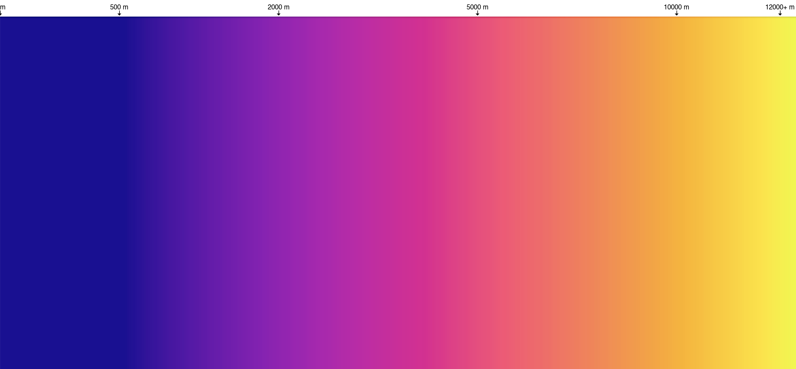

# AirJav

AirJav is a Java-based application that decodes and visualizes live ADS-B (Automatic Dependent Surveillance-Broadcast) aircraft data. It combines real-time signal processing with performance-optimized data analysis to track aircraft positions, velocities, and identification information on an interactive map.

## Table of Contents

- [Preview](#preview)
- [What is ADS-B?](#what-is-ads-b)
- [Features](#features)
- [How It Works](#how-it-works)
- [Installation](#installation)
- [Prerequisites](#prerequisites)
- [Usage](#usage)
- [Project Structure](#project-structure)
- [Architecture](#architecture)
- [Technical Details](#technical-details)

## Preview

<p align="center">
  
</p>

## Map Interface

The interactive map background is powered by OpenStreetMap tiles, providing detailed geographical context for aircraft visualization. The map displays terrain, cities, roads, and water bodies, allowing users to see aircraft positions relative to the landscape below.

<p align="center">
  
</p>

## What is ADS-B?

Aircraft continuously broadcast digital radio messages called ADS-B messages at 1090 MHz, transmitting their identity, position, velocity, heading, and other flight data. AirJav captures these signals either from a Software Defined Radio (SDR) device or pre-recorded data files, then decodes and displays the aircraft on an interactive map interface.

## Features

| Feature                           | Description                                                                             |
| --------------------------------- | --------------------------------------------------------------------------------------- |
| **Real-time ADS-B decoding**      | Processes raw radio signals to extract aircraft data using standard aviation protocols  |
| **Interactive map visualization** | JavaFX-powered interface with OpenStreetMap integration showing live aircraft positions |
| **Dual operation modes**          | File mode for offline analysis and live mode for real-time monitoring                   |
| **Aircraft database integration** | Displays call signs, ICAO addresses, aircraft types, and registration information       |
| **Altitude color coding**         | Visual gradient system for quick altitude identification                                |
| **Performance optimized**         | Efficient signal demodulation and message parsing for high-frequency data streams       |

## Altitude Visualization

The application uses the **Plasma** color gradient to represent aircraft altitude, providing immediate visual feedback about flight levels. Lower altitudes are displayed in cooler, darker colors (blue), while higher altitudes transition to warmer, brighter colors (yellow).

The altitude-to-color mapping uses the following formula:

```
color_value = ∛(altitude_meters / 12000)
```

where `altitude_meters` is the aircraft altitude in meters, and `color_value` (ranging from 0 to 1) determines the position on the gradient. The constant 12000 meters approximates the maximum cruising altitude for commercial airliners, and the cube root function provides finer distinction for lower altitudes, which are most critical for air traffic monitoring.

<p align="center">
  
</p>

### Altitude Range Reference

The gradient maps altitude ranges as follows:

| Altitude Range   | Color Region            | Typical Flight Phase                         |
| ---------------- | ----------------------- | -------------------------------------------- |
| 0 - 500 m        | Dark blue               | Takeoff, landing, low-altitude flight        |
| 500 - 2000 m     | Blue to purple          | Climb, approach, low-level flight            |
| 2000 - 5000 m    | Purple to pink          | Mid-altitude flight, regional routes         |
| 5000 - 10000 m   | Pink to yellow          | High-altitude flight, commercial cruising    |
| 10000 - 12000+ m | Yellow to bright yellow | Maximum cruising altitude, long-haul flights |

Aircraft icons and trajectory segments are colored according to this gradient, with trajectory segments using a gradient between the colors corresponding to their endpoint altitudes.

## Installation

### Clone the Repository

```bash
git clone git@github.com:brianbanna/AirJav.git
```

### Set Up in IntelliJ IDEA

1. Open IntelliJ IDEA
2. Select `File` > `New` > `Project from Existing Sources`
3. Navigate to the cloned repository directory
4. Select the project folder and click `OK`
5. Follow the IntelliJ project setup wizard to configure the project

## Prerequisites

### Java 17

Java 17 must be installed on your system. Download from [Oracle's website](https://www.oracle.com/java/technologies/javase/jdk17-archive-downloads.html) or use an OpenJDK distribution.

Verify installation:

```bash
java -version
```

You should see Java 17 listed in the output.

### JavaFX

This application requires JavaFX for its graphical user interface. Install JavaFX following the instructions on the [OpenJFX website](https://openjfx.io/). Ensure JavaFX is properly configured in your IDE's project settings, including module path configuration if using Java modules.

Both Java 17 and JavaFX must be correctly installed and configured before running the application.

## Project Structure

```
src/ch/epfl/javions/
├── adsb/                    # ADS-B message parsing and decoding
│   ├── MessageParser.java   # Main message parser
│   ├── RawMessage.java      # Raw ADS-B message representation
│   ├── AirbornePositionMessage.java
│   ├── AirborneVelocityMessage.java
│   ├── AircraftIdentificationMessage.java
│   └── ...
├── aircraft/                # Aircraft data and database
│   ├── AircraftDatabase.java
│   ├── AircraftData.java
│   ├── IcaoAddress.java
│   └── ...
├── demodulation/            # Signal demodulation from SDR
│   ├── AdsbDemodulator.java
│   ├── SamplesDecoder.java
│   └── PowerComputer.java
├── gui/                     # JavaFX user interface
│   ├── Main.java           # Application entry point
│   ├── BaseMapController.java
│   ├── AircraftController.java
│   ├── AircraftTableController.java
│   └── ...
└── ...                      # Utility classes (Bits, ByteString, GeoPos, etc.)
```

**Key Components:**

- **`adsb/`** - Handles ADS-B protocol message parsing, position decoding, and velocity extraction
- **`aircraft/`** - Manages aircraft database and metadata (call signs, types, registrations)
- **`demodulation/`** - Processes raw radio signals and extracts ADS-B messages
- **`gui/`** - JavaFX controllers and UI components for map display and aircraft visualization

## Architecture

The application is built using object-oriented design principles with a modular architecture:

- **Signal Demodulation** - Processes raw radio signals from SDR devices or files
- **Message Parsing** - Decodes ADS-B protocol messages to extract aircraft data
- **State Management** - Accumulates and maintains aircraft state information
- **GUI Layer** - JavaFX-based interface for interactive visualization

Performance optimization techniques are applied throughout the data processing pipeline, including efficient signal analysis algorithms, optimized message parsing, and concurrent data handling to minimize latency and maximize throughput.
